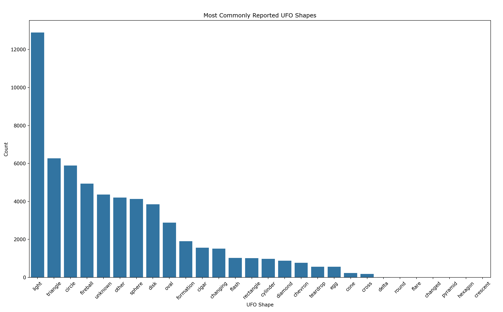

# UFO Sightings Data Analysis

This project was my final project for my first-year Intro to Data Science course. It was also one of the first times I worked on a large dataset on my own.

The dataset contains over 60,000 UFO sighting reports across the United States. My goal was to explore patterns in the data and understand how factors like shape, duration, time, and location relate to each other.

---

## Overview

This was my first experience working independently with a large dataset. I focused on:
- cleaning and preparing the data  
- exploring patterns using visualizations  
- answering simple questions based on the data  

---

## What I Did

- Loaded and explored the dataset using Python (Pandas)  
- Cleaned the data (fixed formatting issues like whitespace in column names)  
- Filtered and grouped the data to focus on relevant parts  
- Created visualizations to understand trends  
- Compared data before and after 1996 (Independence Day release)  
- Calculated probabilities to avoid misleading conclusions  
- Built a simple model to try predicting UFO shape  

---

## Key Questions

- Which UFO shapes are reported the most?  
- Do some states report more sightings than others?  
- Did the movie *Independence Day (1996)* influence disk-shaped sightings?  
- Did encounter duration change over time?  
- Can we predict UFO shape using time, location, and duration?  

---

## Sample Visualizations

### Most Common UFO Shapes


### Impact of Independence Day (1996) on UFO Sightings


### Model Performance for UFO Shape Prediction (Normalized Confusion Matrix)


## Plots / Visualizations

I used different plots to explore the data:

- Pie chart of states with high UFO sightings  
- Bar chart of most common UFO shapes  
- Stacked bar chart comparing shapes by state  
- Line plot showing trends before and after 1996  
- Line plot of median encounter duration over time  
- Bar chart of median duration by shape  
- Confusion matrix heatmap for prediction results  
- Feature importance bar chart  

These helped me understand patterns and also check if the results made sense.

---

## Key Findings

- “Light” was the most commonly reported UFO shape  
- Some states (like California and Washington) had high sightings regardless of population  
- Disk-shaped UFOs increased in count after 1996, but their probability actually decreased  
- Encounter duration decreased over time  
- Less common shapes tended to have longer durations  
- Location, duration, and year were important for predicting UFO shape  

---

## Tools Used

- Python  
- Pandas  
- Matplotlib  
- Seaborn  
- Scikit-learn  

---

## Files

- `ufo_analysis.py` → main code  
- `ufo_sightings.csv` → dataset  

---
## How to Run

```{bash}
python ufo_analysis.py
```

---
## Final Thoughts

This project was a big step for me because it was the first time I handled a large dataset on my own from start to finish. It helped me understand how important data cleaning is, and how visualization can help make sense of messy real-world data.

